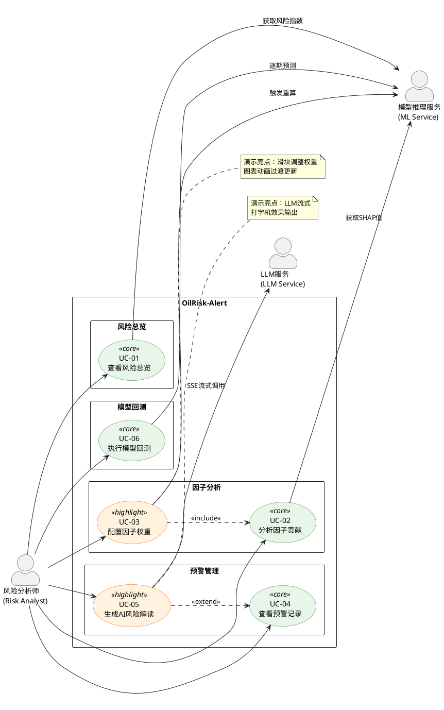

# OilRisk-Alert 软件需求规格说明书 (SRS)

> **项目**：OilRisk-Alert — 基于多源数据与 Agent 的原油价格风险智能预警系统
> **版本**：v2.0
> **日期**：2026-02-21

---

## 一、系统概述

### 1.1 系统目标

构建一个面向竞赛评委演示的原油价格风险智能预警系统，核心能力包括：

- 基于多源因子的风险指数量化与可视化
- 基于 ML 模型的风险预测与 SHAP 可解释性输出
- 多级风险预警引擎（阈值 / 趋势 / 因子异动）
- 基于 LLM 的自然语言风险解读生成（流式输出）
- 用户可交互的因子权重配置与实时重算

### 1.2 系统边界

- **包含**：数据服务、模型推理服务、预警引擎、前端 Dashboard
- **不包含**：用户注册/登录/鉴权、数据自动采集（ETL Pipeline）、模型训练流程
- **部署形态**：本地单机运行（演示用途）
- **数据范围**：2015 年至今（默认展示近两年，支持切换至全量）

### 1.3 参与者（Actors）

| Actor | 类型 | 描述 |
|-------|------|------|
| 风险分析师 (Risk Analyst) | 主要参与者 | 系统唯一人类用户，查看风险状态、配置参数、触发分析 |
| 模型推理服务 (ML Service) | 外部系统 | 封装 XGBoost / LSTM / ARIMA 等模型，提供预测与解释接口 |
| LLM 服务 (LLM Service) | 外部系统 | 大语言模型 API，生成自然语言风险解读报告 |

---

## 二、用例模型

### 2.1 主要用例清单

| 编号 | 用例名称 | 所属子系统 | 涉及 Actor |
|------|---------|-----------|-----------|
| UC-01 | 查看风险总览 | 风险总览 | 分析师、ML Service |
| UC-02 | 分析因子贡献 | 因子分析 | 分析师、ML Service |
| UC-03 | 配置因子权重 | 因子分析 | 分析师、ML Service |
| UC-04 | 查看预警记录 | 预警管理 | 分析师 |
| UC-05 | 生成 AI 风险解读 | 预警管理 | 分析师、LLM Service |
| UC-06 | 执行模型回测 | 模型回测 | 分析师、ML Service |

### 2.2 系统用例图

> **图例**：绿色 = 核心用例，橙色 = 演示亮点用例

---

## 三、用例详细说明

### UC-01：查看风险总览

| 项目 | 内容 |
|------|------|
| **用例编号** | UC-01 |
| **用例名称** | 查看风险总览 (View Risk Overview) |
| **参与者** | 风险分析师、模型推理服务 |
| **简述** | 分析师进入系统，一屏查看当前风险指数与等级、油价历史走势叠加预警标记、Top-5 因子贡献、最新预警摘要、LLM 风险小结 |
| **前置条件** | 系统已启动；历史因子数据与模型权重已加载 |
| **后置条件** | 概览页完整渲染：风险仪表盘、走势图、因子榜、预警卡片、LLM 摘要 |
| **主流程** | 1. 分析师打开系统，默认进入概览页 |
| | 2. 前端并发请求：当前风险数据（`GET /api/risk/current`）、历史时序数据（`GET /api/factors/timeseries`）、最新预警（`GET /api/alerts?size=3`） |
| | 3. 后端调用模型推理服务获取当前风险指数（0-100）、风险等级（Low/Medium/High）、Top-5 因子 SHAP 贡献 |
| | 4. 前端渲染：风险仪表盘（圆环图）、油价与风险指数双轴折线图（叠加预警散点）、Top-5 因子贡献水平柱状图、最新 3 条预警摘要卡片 |
| | 5. 底部折叠区域展示上次缓存的 LLM 风险小结文本 |
| **替代流程** | 3a. 模型推理服务不可用 → 展示最近一次缓存数据，标注"数据非实时" |
| | 4a. 时序数据 >2000 点 → 自动启用 LTTB 降采样 |
| **业务规则** | BR-01, BR-02, BR-04 |

---

### UC-02：分析因子贡献

| 项目 | 内容 |
|------|------|
| **用例编号** | UC-02 |
| **用例名称** | 分析因子贡献 (Analyze Factor Contributions) |
| **参与者** | 风险分析师、模型推理服务 |
| **简述** | 分析师在因子分析页查看各因子 SHAP 贡献度排名与五大类别风险雷达图，理解当前风险的驱动来源 |
| **前置条件** | 模型推理服务可用；当期因子数据已就绪 |
| **后置条件** | 页面展示因子贡献度排名图与五维雷达图 |
| **主流程** | 1. 分析师导航至因子分析页 |
| | 2. 前端请求因子解释（`GET /api/explain/{date}`）与分类评分（`GET /api/risk/radar`） |
| | 3. 模型推理服务返回各因子 SHAP 值（正/负）与五大类别聚合评分 |
| | 4. 前端渲染：Top-10 因子贡献度水平柱状图（正值蓝色、负值红色）+ 五维雷达图（供需/宏观/金融/地缘/情绪） |
| | 5. Hover 雷达轴线 → Tooltip 展示该类别下 Top-3 因子明细 |
| **替代流程** | 3a. SHAP 计算超时 → 返回上次缓存结果并标注 |
| **业务规则** | BR-03, BR-04 |

---

### UC-03：配置因子权重

| 项目 | 内容 |
|------|------|
| **用例编号** | UC-03 |
| **用例名称** | 配置因子权重 (Configure Factor Weights) |
| **参与者** | 风险分析师、模型推理服务 |
| **简述** | 分析师通过滑块调整五大因子类别权重，触发模型实时重算，页面所有图表以动画过渡方式联动更新 |
| **前置条件** | UC-02 已渲染；模型推理服务可用 |
| **后置条件** | 风险指数、因子贡献度排名、雷达图均按新权重更新 |
| **主流程** | 1. 因子分析页展示五个滑块（供需/宏观/金融/地缘/情绪），初始值为模型默认权重 |
| | 2. 分析师拖动滑块调整权重（0%–100%） |
| | 3. 前端 debounce 300ms 后发送新权重向量（`PUT /api/config/weights`） |
| | 4. 后端转发至模型推理服务，触发基于新权重的风险指数重算 |
| | 5. 后端返回新的风险指数、SHAP 值、分类评分 |
| | 6. 前端以 ECharts transition 动画（800ms cubicOut）联动更新因子贡献图、雷达图、风险指数 |
| **替代流程** | 4a. 模型重算超时（>5s） → 前端展示加载态，超时提示"计算超时" |
| | 2a. 点击"重置"按钮 → 恢复默认权重，触发重算 |
| **业务规则** | BR-05 |

---

### UC-04：查看预警记录

| 项目 | 内容 |
|------|------|
| **用例编号** | UC-04 |
| **用例名称** | 查看预警记录 (View Alert Records) |
| **参与者** | 风险分析师 |
| **简述** | 分析师在预警记录页浏览历史预警列表，支持筛选/排序，点击单条预警可展开查看触发原因链 |
| **前置条件** | 预警记录数据已入库 |
| **后置条件** | 页面展示预警列表；选中条目展示原因链详情 |
| **主流程** | 1. 分析师导航至预警记录页 |
| | 2. 前端请求预警列表（`GET /api/alerts?page=1&size=20`） |
| | 3. 页面渲染预警时间线（散点沿时间轴分布，颜色按等级）+ 预警列表（表格：日期、等级、触发因子、风险指数） |
| | 4. 分析师可按等级筛选（Low / Medium / High / All）、按时间或风险指数排序 |
| | 5. 分析师点击某条预警 → 前端请求详情（`GET /api/alerts/{id}`） |
| | 6. 展开详情面板：触发规则链（规则类型、触发因子、当期值 vs 阈值），以瀑布/时间线形式展示 |
| **替代流程** | 4a. 筛选后无结果 → 展示空状态 |
| **业务规则** | BR-06, BR-07 |

---

### UC-05：生成 AI 风险解读

| 项目 | 内容 |
|------|------|
| **用例编号** | UC-05 |
| **用例名称** | 生成 AI 风险解读 (Generate AI Risk Interpretation) |
| **参与者** | 风险分析师、LLM 服务 |
| **简述** | 分析师在预警详情中点击"生成AI解读"，LLM 基于预警上下文数据以流式打字机效果输出自然语言分析 |
| **前置条件** | UC-04 已展开某条预警详情；LLM 服务可用 |
| **后置条件** | 详情面板中展示 LLM 生成的解读文本 |
| **主流程** | 1. 分析师在预警详情面板中点击"生成AI解读"按钮 |
| | 2. 前端发起 SSE 请求（`GET /api/report/{alert_id}?stream=true`） |
| | 3. 后端组装 Prompt（预警日期、风险指数、触发规则链、关键因子数据） |
| | 4. 后端调用 LLM API（streaming 模式），逐块通过 SSE 推送 token |
| | 5. 前端逐字渲染文本（打字机效果），同时缓存完整文本 |
| | 6. 生成完毕后，后端将完整文本写入缓存 |
| **替代流程** | 4a. LLM 不可用 → 提示"AI 服务暂不可用" |
| | 1a. 已有缓存 → 直接展示缓存文本，按钮变为"重新生成" |
| **业务规则** | BR-08 |

---

### UC-06：执行模型回测

| 项目 | 内容 |
|------|------|
| **用例编号** | UC-06 |
| **用例名称** | 执行模型回测 (Execute Model Backtest) |
| **参与者** | 风险分析师、模型推理服务 |
| **简述** | 分析师选择历史区间与模型类型，系统展示实际油价 vs 模型预测对比图与回测统计；可切换模型对比 |
| **前置条件** | 模型权重已加载；历史因子数据可用 |
| **后置条件** | 页面展示回测对比图与统计指标 |
| **主流程** | 1. 分析师导航至模型回测页 |
| | 2. 通过日期选择器指定回测区间（start_date, end_date） |
| | 3. 选择模型类型（默认 XGBoost，可选 ARIMA / LSTM） |
| | 4. 前端请求回测（`POST /api/predict/backtest`，body: {start, end, model}） |
| | 5. 后端调用模型推理服务逐期预测 |
| | 6. 返回：实际值序列、预测值序列、回测统计（命中率、误报率、MAE、方向准确率） |
| | 7. 前端渲染实际 vs 预测双轴折线图 + 统计指标卡片 |
| | 8. 分析师切换模型 → 前端以当前区间 + 新模型重新请求 → 图表动画过渡至新预测曲线 |
| **替代流程** | 5a. 回测区间 >3 年 → 提示"区间较大"并展示进度条 |
| | 8a. 可叠加多模型曲线同时对比 |
| **业务规则** | BR-09, BR-10 |

---

## 四、业务规则汇总

| 编号 | 规则名称 | 描述 |
|------|---------|------|
| BR-01 | 风险等级阈值 | Low: [0, 40)，Medium: [40, 70)，High: [70, 100]。可在配置文件中调整 |
| BR-02 | 默认时间窗口 | 所有时序图表默认展示近两年数据；可手动切换至 2015 年起全量 |
| BR-03 | 因子展示数量 | 贡献度排名默认展示 Top-10；因子名称中英双语 |
| BR-04 | 五维因子分类 | 固定五类：供需 (Supply-Demand)、宏观 (Macro)、金融 (Financial)、地缘 (Geopolitical)、情绪 (Sentiment) |
| BR-05 | 权重独立性 | 五类权重各自独立取值 0%–100%，不要求总和为 100% |
| BR-06 | 预警列表排序 | 默认按触发时间倒序；每页 20 条 |
| BR-07 | 预警触发规则 | 三类机制：阈值触发、趋势触发（连续 N 期上升）、异动触发（周环比超 M%） |
| BR-08 | LLM 输出约束 | 语言跟随系统 locale（中/英）；单次上限 500 token；已缓存则直接读取 |
| BR-09 | 回测指标定义 | 命中率 = 预警等级与实际波动方向一致比例；方向准确率 = 涨跌方向正确比例 |
| BR-10 | 模型类型 | ARIMA（基准）、XGBoost（默认）、LSTM；支持多模型叠加对比 |

---

## 五、辅助功能说明

以下功能不作为独立用例建模，作为全局辅助功能集成于系统顶栏：

| 功能 | 描述 | 实现要点 |
|------|------|---------|
| 语言切换 | 中/英双语切换，所有页面文本与图表标签即时响应 | vue-i18n；因子名称维护中英映射表 |
| 主题切换 | 暗色/亮色主题切换，默认暗色 | CSS 变量 + ECharts Theme 双套 |
| 时间窗口选择 | 预设区间（近1年/2年/5年/全量）或自定义日期范围 | 全量模式 >2000 点时启用 LTTB 降采样 |

---

## 六、接口契约概览

| 端点 | 方法 | 描述 | 关联用例 |
|------|------|------|---------|
| `/api/risk/current` | GET | 当前风险指数、等级、Top-5 因子 | UC-01 |
| `/api/risk/radar` | GET | 五维分类风险评分 | UC-02 |
| `/api/factors/timeseries` | GET | 历史因子时序数据（含油价） | UC-01 |
| `/api/explain/{date}` | GET | 指定日期 SHAP 因子解释 | UC-02 |
| `/api/config/weights` | PUT | 更新因子权重并触发重算 | UC-03 |
| `/api/alerts` | GET | 分页查询预警记录（筛选/排序） | UC-04 |
| `/api/alerts/{id}` | GET | 单条预警详情（含触发规则链） | UC-04 |
| `/api/report/{alert_id}` | GET | 预警 AI 解读（支持 SSE 流式） | UC-05 |
| `/api/predict/backtest` | POST | 历史回测 | UC-06 |

---

## 七、用例 — 页面映射

| 页面 | 包含用例 | 侧边栏标签 |
|------|---------|-----------|
| 概览页 | UC-01 | 风险概览 / Risk Overview |
| 因子分析页 | UC-02, UC-03 | 因子分析 / Factor Analysis |
| 预警记录页 | UC-04, UC-05 | 预警记录 / Alert Records |
| 模型回测页 | UC-06 | 模型回测 / Model Backtest |

---

## 八、术语表

| 术语 | 英文 | 定义 |
|------|------|------|
| 风险指数 | Risk Index | 模型输出的综合风险评分，取值 0-100 |
| 因子 | Factor | 影响油价波动的可量化变量（如库存变化、美元指数等） |
| SHAP 值 | SHAP Value | Shapley Additive Explanations，衡量单个因子对模型预测的边际贡献 |
| 预警 | Alert | 风险指数或因子状态满足触发规则时生成的记录 |
| 回测 | Backtest | 使用历史数据验证模型预测效果的过程 |
| SSE | Server-Sent Events | 服务端向客户端单向推送消息的协议，用于 LLM 流式输出 |
| LTTB | Largest-Triangle-Three-Buckets | 保留视觉特征的时序数据降采样算法 |

---

*文档版本：v2.0*
*制定日期：2026-02-21*
